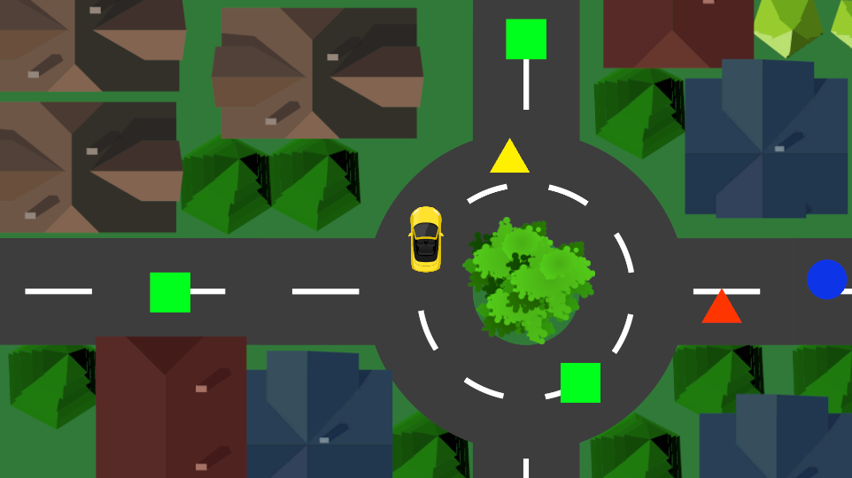

# Delivery Driver

Delivery Driver is a 2D driving game where you take on the role of a delivery driver with the task of picking up packages and delivering them to customers. Navigate through the city, avoiding collisions, and strategically managing your speed to ensure successful deliveries.

## Table of Contents

- [Overview](#overview)
- [Features](#features)
- [How to Play](#how-to-play)
- [Credits](#credits)

## Overview

In Delivery Driver, your goal is to efficiently deliver packages to customers while overcoming obstacles and bumping in to something. Manage your speed, avoid collisions, and ensure a smooth delivery process to become the ultimate delivery driver.

## Features

- Engaging 2D driving gameplay with a delivery twist.
- Pick up and deliver packages one by one.
- Car color changes when a package is taken and returns to normal upon delivery.
- Speed adjustments based on collisions and speed-boosting platforms.

## How to Play

- Drive the Car: Use arrow keys to navigate through the city.
- Pick Up Packages: Approach a package to pick it up. You can only carry one package at a time.
- Deliver Packages: Reach the customer's location to deliver the package. Your car color will change when carrying a package.
- Manage Speed: Avoid collisions and use speed-boosting platforms strategically to maintain optimal speed.

## Credits

Special thanks to Rick Davidson from GameDev.tv for this project.